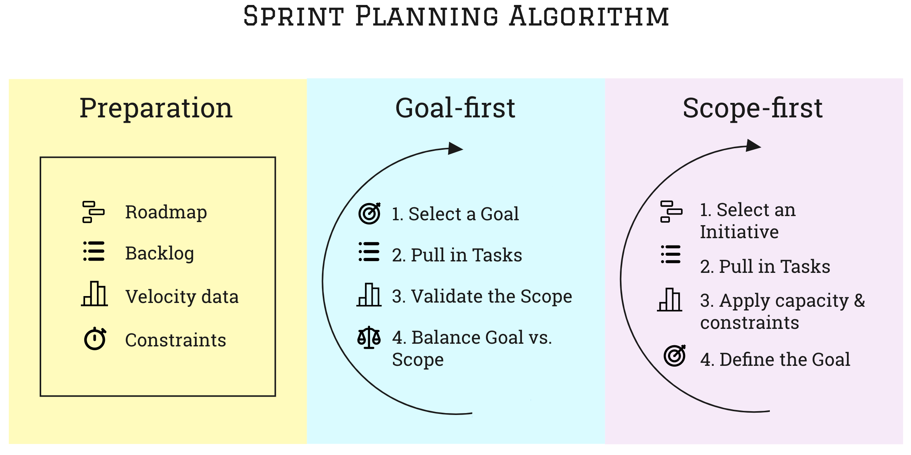

# Sprint planning algorithm

Quick recap of a sprint planning process

| **Purpose**   | Plan a sprint in a structured way |
| ------------- | --------------------------------- |
| **Situation** | Running a sprint planning meeting |
| **Outcomes**  | - Goals for the sprint are set    |
|               | - Scope of the sprint is set      |
| **Effort**    | Medium                            |
| **Scope**     | Short-term                        |

## Infographics

## Situation

Sprint planning is one of the most important meetings in SCRUM. In Kanban you're probably doing a kind of Replenishment meeting for a similar purpose too. If you use neither of these but rather some kind of a lightweight Plan - Build - Ship cycle, it still has the Plan phase. This page is a reminder of how the planning works.

We will use the word Sprint as a synonym of Iteration in any kind of an agile process.

## Ingredients

Here is what you need before running a sprint planning:

- Strategic objectives or a **Roadmap**
- **Backlog** of tasks, refined and prioritized
- Prior track of team's **velocity** and goal achievement
- A list of **constraints** such as: external dependencies, team's availability, time off, etc.

## Goals first or scope first?

All ingredients are ready, you and your team are in the meeting room, and it's time to start. What do you define first: the goals or the scope of the sprint? The answer is not trivial.

In classic SCRUM you define the goals first and then try to set the scope of the sprint in such a way, that the team can meet the goals on time given all the constraints. That may require stripping the deliverables down or compromising on some aspects.

The other way around also works: first pulling the tasks into the sprint and setting the sprint scope. Then creating an umbrella of deliverables and goals on top of these tasks. This way is only going to work if you keep the priorities and constraints in mind: use priorities when adding tasks to the sprint, use constraints to remove those which don't fit in.

Both ways are equally effective and proven to work well. Which approach to use depends on your team's preferences. You can try both and see which one sticks with the team.

## The planning algorithm

All the steps below require *team effort* and are not meant to be pushed top-down by managers. Involve the team in every step so that they *own their goals* and commit to them.

### Goal-first planning algorithm

1. Select an ambitious **goal** for the sprint, using team's *Roadmap* or some other kind of a strategic plan. Highest priority initiative first
2. Pull in all the **tasks** from the *Backlog* required to achieve that goal
3. Validate the resulting **scope** (story points, number of tickets) against prior team *velocity*, *throughput*, and the *constraints* in the upcoming sprint
4. If the scope of the sprint needs to be reduced, agree on making the goal smaller. Redefine the goal and remove tasks that are not required to achieve the new goal. Repeat from step 3 to validate the new scope
5. If there is no way to come up with a smaller goal, or delivering the smaller goal is not reasonable from the strategic point of view, go back to step 1 and pick another goal from the Roadmap
6. The work for the current goal is successfully submitted to the sprint. If according to the velocity and available capacity data there is still space in the sprint, repeat the process for another goal.

### Scope-first planning algorithm

1. Select highest priority **initiative** from the *Roadmap* or other kind of a strategic plan
2. Start adding **tasks** for that initiative into the sprint. Highest priority tasks first
3. Stop adding tasks when the expected **capacity** of the sprint is reached. Use *velocity*/*throughput* and *constraints* data for that
4. Define a goal that contains all the work that was added to the sprint for that initiative. It should represent some kind of a deliverable or a clear milestone. Otherwise reshuffle the tasks in such a way that they start to form a kind of a deliverable.
5. If there is still space in the sprint, repeat the process for the next item in the Roadmap

## Troubleshooting

Let's address some common issues while running the plannings.

### Backlog is not ready for planning

The algorithm described above assumes that the ingredients are ready. What happens when tickets for the tasks/stories haven't been created in advance or don't contain all the necessary information? The planning gets stuck.

Some typical emergency actions when this happens:

- Pause the planning and create missing tickets right there, then continue. This works if the missing tickets are not too many and the team has all the necessary context on their fingertips. Then the time cost of this measure is low enough for the planning to resume normally.
- Skip to a different initiative that has tickets ready. Or even run a shorter iteration this time and prepare for the next one better.
- Postpone the planning and focus on refining the missing parts of the Backlog first. This can work effectively as a one-off measure. If it becomes a pattern, it starts to affect the team in a way that the planning process feels very heavy. In fact, the whole day may turn into a planning day.
- Use a more radical technique such as [Planning Day](./planning-day.md). Remember, that it is a short-term measure.

Often times, disruptions of this kind during a planning is a signal to a manager that some effort should be put in improving the refinement of user stories and technical tasks.

### Where to put bugs?

Alright, the algorithm above works for new features and maybe refactoring, but how to address bugs? Bug reports pop up randomly, they often times don't belong to any future initiatives, and take unpredictable amount of time to fix.

Here are a few approaches that your team can use to plan working on bugs:

- Create a goal to fix X amount of bugs in the sprint. Then apply the planning algorithm

- Leave a buffer for bugs. Based on capacity, leave a certain % of it to fix the bugs, and include bug tickets that the team thinks would fit in that buffer

- Radical: put all the bugs in the sprint first

Prioritizing bugs is a complicated topic, so these are just some basic measures that you can take right in the planning without reshaping team's processes.

## Conclusion

I hope you find this page a useful reminder. If something stands out to you or you feel like missing here, please file a PR.

Happy planning!
