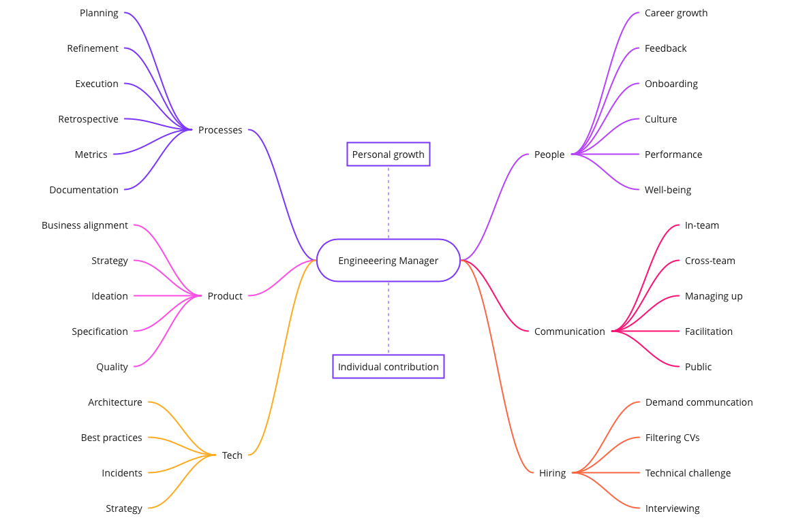

# Engineering Manager's Runbook

Management patterns and situational techniques for Engineering Managers.

## Who is an Engineering Manager?

This mind map represents a compilation of observations and an opinion on what an Engineering Manager does or cares about. It is not exhaustive or in-depth, so there are many other things, but these in my opinion are the most common ones.

More about the job of an EM in [Engineering Manager Role](./engineering-manager-role.md).

## Index

- [Engineering Manager Role](./engineering-manager-role.md)
- [People](./People)
  - [Growth](./People/Growth)
    - _Clear Career Path (TODO)_
    - _Mentorship Program (TODO)_
    - [Project Tech Leads](./People/Growth/Project%20Leads)
    - _Rotation Program (TODO)_
  - _Onboarding (TODO)_
    - _Onboarding Checklist (TODO)_
    - _Warm Welcome (TODO)_
  - [One-on-one](./People/One-on-one)
    - [One-on-one Document Template](./People/One-on-one/One-on-one%20Doc%20Template)
    - _Question Bank (TODO)_
  - [Well-being](./People/Well-being)
    - [Guess Each Other by Fun Facts](./People/Well-being/Guess%20Each%20Other%20by%20Fun%20Facts)
- [Processes](./Processes)
  - [Planning](./Processes/Planning)
    - _Kick-start the Week (TODO)_
    - [Natural Weekly Rhythm](./Processes/Planning/Natural%20Weekly%20Rhythm)
    - [Planning Day](./Processes/Planning/Planning%20Day)
    - [Sprint Planning Algorithm](./Processes/Planning/Sprint%20Planning%20Algorithm)
    - _Zero Bugs Backlog (TODO)_
  - _Refinement (TODO)_
    - _Cascading Refinement Flow (TODO)_
    - _Estimate and No-Estimate (TODO)_
  - [Retrospective](./Processes/Retrospective)
    - [Dungeons and Dragons Retro](./Processes/Retrospective/Dungeons%20and%20Dragons%20Retro)
- [Library](./Library)
  - [Awesome EM collections](./Library/Awesome%20EM)
  - [Resources for Engineering Managers](./Library/Resources)

## Why a runbook?

Life of an engineering manager consists of many variables and moving targets, and success often depends on their ability to adapt to reality of the team, the organization, and the market. According to Westrum's organizational culture research, teams driven solely by hard rules enforced from above are not the ones among the top performers. But still, there is a lot of routine and repetitiveness in engineering manager's work, no matter whether the team is mission-driven or process-driven.

This runbook is a collection of tips and reminders that I decided to use in my day to day work to reduce the amount of decision making. Or just as a reminder of what worked last time in a similar situation. However, these techniques will not necessarily make you a successful manager. Understanding what is really happening in your team is more important than following any instruction.

It is not supposed to be a textbook or a curated list of links. For that see some nice resources in the [Library](./Library) section. Rather than that, it only contains short recipes that were tried and proved to work successfully in practice by myself or by people who contributed these recipes. If possible, links to further reading are also provided.

## How to read this runbook

Following the mind map above, the runbook is split by _category_. Categories represent directions of manager's work, such as "People" or "Processes". Each category has an index file for easier navigation.

Each category contains subcategories. Typical examples of a subcategory are: "Planning", "One-on-one". Each subcategory lists _situations_ - typical context that occurs within that category and requires manager's action.

For each situation there can be multiple recipes, each recipe describes a set of instructions or a technique.

## Schedule

_TODO: this section will contain a calendar with recommended regular recurring activities_

## Contributing

If you want to share your best practices following the similar format, your PR is more than welcome! I reserve the right to decline it or ask for modifications if it doesn't fit the purpose of this repository or breaks ethical norms.

Don't forget that you can always fork the repo and create your personal runbook!

---

