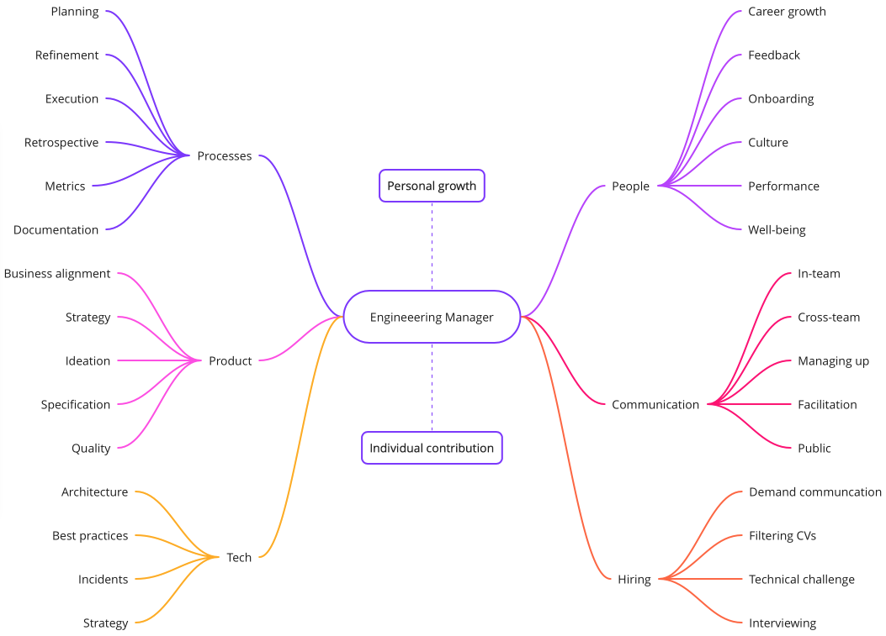

# Engineering Manager's role

An Engineering Manager (EM) is a person who leads an engineering team and is typically responsible for more than one of the following aspects of the team:

- People
- Projects
- Processes
- Technology

The term Engineering Manager usually refers to a direct line manager, but there are also managers of managers. Some people combine both roles.

## What an Engineering Manager does

Here is a high-level version of EM activites mind map again:

## Expectations from an EM

This is how @bobuk described what the team expects from their manager in his [talk](#references) at Yandex Management School:

1. Demonstrate stability. Be the source of calm and confidence for the team
1. Protect the team from external disturbance
1. Predict how a project will go. In lack of data, make a best guess
1. Be a generalist. Know just enough of everything that the team does. Narrow expertise doesn't scale
1. Be the source of positive vibe
1. Always be available. The team should feel like the manager is always around
1. Reward people fairly
1. Stop hysteria and rumors. Just stop it
1. Know everything that is happening with people, even personal things
1. Set context and expectations, but not tell people what to do
1. Keep manager's word. Not promise anything the manager can't guarantee
1. Work to implement dream projects, not for the sake of metrics or the management process on its own

## Types of Engineering Managers

You will find multiple classifications on the internet, there are several example references given below. A common thread is that there are at least following archetypes of Engineering Managers or leaders in a team:

1. **Technical Leader** (aka Tech Lead, Team Lead, Architect, etc.): is the most technically experienced and knowledgeable person in the team, who is responsible for making ultimate technical decisions, writing design documents, and supporting the team with any sort of technical issue. As a single responsibility, it overlaps with the role of a Staff Engineer.
2. **Process Manager** (aka Technical Program Manager, Project Manager): is responsible for timely delivery of the backlog in the team, and for sustainable and reproducible workflow. Often overlaps with the role of an Agile Coach and a Project Manager.
3. **People Manager** (aka Career Development Manager): is a person responsible for career development of the engineers in the team, performance management, team's culture, individual well-being, and protection of the team from aggressive communication and organizational volatility.

Typically an Engineering Manager combines more than one of these roles in the team. In some teams (e.g. Platform teams) an EM also covers the responsibilities of a Product Manager.

It is unrealistic to expect any Engineering Manager to handle all these activities equally well. Usually it depends on personal traits, and a person leans more towards one archetype or another: e.g. some lead may be extremely focused on Processes and not so much on People, and another lead cares a lot about technical excellence while everything else is not so important for them.

Managers who pay equal attention to all these aspects and who can handle them equally well are quite rare. And this is fine. Different teams need different leaders, and missing skills can be developed.

## References

1. [github.com/charlax/engineering-management](https://github.com/charlax/engineering-management)
1. [Non-violent Management (Video) (Russian)](https://youtu.be/iYhaK_BpO8w) by Grigory Bakunov
1. [5 Engineering Manager Archetypes](https://www.patkua.com/blog/5-engineering-manager-archetypes) by Patrick Kua
1. [Flavors of Engineering Management](http://blog.benjamin-encz.de/post/flavors-of-engineering-management/) by Benjamin Encz