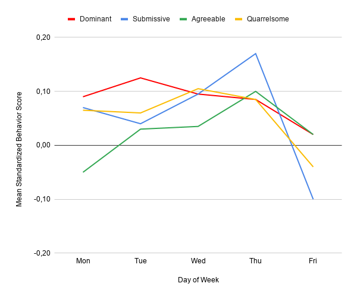
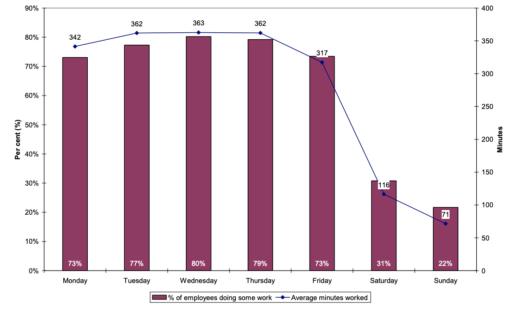
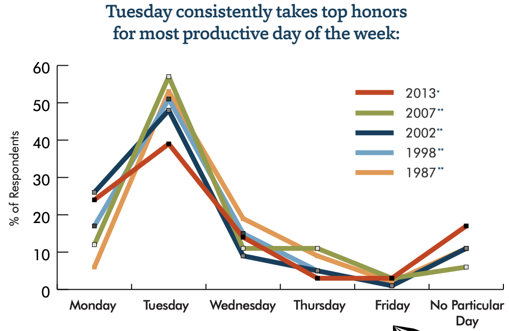

# Natural sprint rhythm

_Synchronize the rhythm of sprints with productivity cycles for majority of people in the team to reduce stress and increase effectiveness._

|Purpose|Use time during sprints more effectively|
|-|-|
|Situation|- Team's schedule is fragmented by meetings and it barely contains focus time|
||- The team feels exhausted by sprints ending/beginning in the middle of the week|
|Outcomes|- More focus time, higher productivity of work requiring focus|
||- No "full stop" or "horse race" effect of finishing one sprint and having to start a new one right after|
||- Reduced stress levels|
|Effort|Low|
|Scope|Long-term|

## Situation

### Loss of focus caused by meetings

Often times in the retrospectives we hear something like:

> "There are meetings every day, I don't have enough time to focus on my tasks"

The first aid solution to this includes:

- Reduce the amount of meetings. Don't call a meeting for what could be an email or a Slack conversation
- Add a clear agenda to every meeting
- Provide steps to prepare for the meeting in advance

But what if the team has already reduced its meeting time to the bare minimum required to function well?

_Can the team arrange the meetings during the sprint so that they are productive and don't take up too much focus time?_

### A never ending sprint

Another problem that we are going to address in this article is rarely voiced openly in the retrospectives. But sometimes people share it in private if they feel safe enough to do so:

> "I feel like the work is never ending. We close one sprint, and start a new one right after."
>
> "There is no feeling of accomplishment. As soon as I finish something, I have to start running towards the next goal."

These feelings usually arise in the following cases.

1. The team is overloaded with work
1. There is no feeling of accomplishment
1. There is no gap between iterations (sprints)

#### The team is overloaded with work

This case is worth a whole book. It can be a symptom of a million problems. Stay tuned for articles on realistic goal setting in this repository.

#### There is no feeling of accomplishment

Here is the "accomplishment 101" for your team:

- Have a retrospective and a review/demo at the end of each sprint
- Review/demo is a place to celebrate progress and collect constructive feedback
- Add a kudos/thanks section in the retrospective
- Praise people for all the effort
- Make deliverables smaller, so that your team can regularly achieve their goals

If your team is doing all of these and still they feel exhausted, then keep on reading for more symptoms.

#### There is no gap between iterations (sprints)

Many teams close a sprint and start the next one on the same day or the next day. While it has some benefits, it leaves no time for people to rest after a period of intense work.

It may be fine in a short term, but in long term fatigue and stress may become real. We will focus on this problem more closely in this post.

## Considering alternatives

In this section we will look at what teams usually do about their time macro-management. These are the solutions you find on the internet most of the times. We'll list some pros and cons of these approaches.

### Don't start the sprint on Monday

If you google the "best day to start a sprint", most of the articles in top results share the same thread:

> Starting sprints on Monday and finishing them on Friday is a bad idea.

Here are the common reasons why this is true for many teams:

- On Monday it takes more time and effort for the team to switch from weekend mood to a work mindset.
- At least 2 days in a sprint (Monday and Friday) are packed with team's ceremonies.
- On Friday people want to ease into the weekend. But if there is a lot of work left in the sprint, it becomes a hustle time. Trying to finish stuff between the meetings is a nightmare.
- Worst case scenario: the work that isn't finished on time during the week gets finished on the weekend.

What do these articles usually suggest as a solution? Finish a previous sprint and start a new one in the middle of the week. Ideally on the same day on Wednesday: wrap up the last sprint in the morning, plan the next one in the afternoon.

Here are the advantages of this approach:

- The team is warmed up and has a lot of energy in the middle of the week, so the meetings go rather productively.
- Having all meetings concentrated in one day leaves a lot of space for focus work in the rest of the sprint.
- If some important work isn't finished on time, it can be completed the next day which is not weekend.

These are very good reasons. And for many teams finishing/starting sprints in the middle of the week is a solution to relevant problems.

However, it comes with a cost: there is no time to celebrate the success, and no time to recharge batteries before a new journey. And that is not the only drawback of this approach.

### The middle sprint dilemma

More drama comes from the [research on weekdays and productivity](#references):

**_If you start your sprints in the middle of the week, your team spends its most productive time in meetings._**

This could be fine for managers, because meetings is their primary activity. But unless meetings is the main product of your team, the engineers would rather invest it in something else. For example, working on complex tasks.

That brings us to an obvious conclusion: there is no silver bullet, each sprint rhythm model has its pros and cons.

### The root of carryover

Let me warn you of a very important problem that the Mid-week Sprints can be concealing:

> The work does not carry over because the sprint ends on a wrong weekday. The work carries over because of unrealistic planning and unforeseen impediments.

So often we feel guilty of not finishing something on time. We try to compensate for that guilt by working extra hours or weekends. Or we "take time" from the next sprint to "finish" the previous one. And then we need to compensate for that "borrowed time" in the next sprint again. This is a vicious circle. As any vicious circle it ends in emotional burnout of the team and resignation of the most responsible team members.

To get out of this vicious circle your team needs to do two things:

1. Keep improving the planning process towards setting realistic goals and incorporating buffers in sprints.
1. Become friends with unforeseen impediments and things going not as planned.

If the main theme of your retrospectives is "how can we work harder?", consider changing it to "what have we observed and what can we adjust to act differently?".

## Natural sprint rhythm

With this approach we are simply back to the roots: the sprint starts on Monday and ends on Friday. A sprint can last for one or two weeks. Two-week cycle is more typical for Scrum-like process because of the overhead costs of closing/starting a sprint. One-week cycle works well together with Kanban-like process.

Most of the team meetings are concentrated in the beginning and the ending of the week. The middle of the week is deep focus time with as few meetings as possible. And weekends are the time to recharge between sprints.

### Example from a Scrum team

We have a team which runs 2-week sprints. Each sprint contains the following team activities:

- 1 x Sprint Planning (60 minutes): setting the scope and goals for the sprint
- Daily Standups (10-15 minutes)
- 2 x Refinement (aka Replenishment, 60 minutes each): introducing new initiatives, ideation, group specification, ticket creation and estimation. Two sessions of 60 minutes is bare minimum, if needed more sessions are scheduled around the same time slots
- Product Update (15-30 minutes): an update on experiment results, user feedback, KPIs, upcoming topics
- Mid-Sprint Check-in (10-15 minutes): a meeting to remember the goals and check in on our progress after the weekend 
- Demo (15-30 minutes): showing things that we recently built to stakeholders and collecting early feedback from the team on work in progress
- Sprint Review (15 minutes): reviewing Sprint results - goals, metrics
- Retrospective (60-90 minutes)
- Friday cheers: time to finish the week and chat about things over a drink or food, non-mandatory

Here is how it would look on the calendar:

**Week 1**

|Day|Monday|Tuesday|Wednesday|Thursday|Friday|
|---|------|-------|---------|--------|------|
|Morning|Standup [10m]|Standup [10m]|Standup [10m]|Standup [10m]|Standup [10m]|
|Morning|_Preparation for planning_|Refinement [60m]|||
|Afternoon|Planning [60m]||||Product Update [15m]|
|Afternoon|||||Friday cheers|

**Week 2**

|Day|Monday|Tuesday|Wednesday|Thursday|Friday|
|---|------|-------|---------|--------|------|
|Morning|Mid-Sprint Check-in [10m]|Standup [10m]|Standup [10m]|Standup [10m]|Standup [10 min]|
Morning|||||
|Afternoon|Refinement [60m]||||Demo + Review [30m]|
|Afternoon|||||Retrospective [90m]|

As you can see, all the meetings are either in the beginning or at the end of the sprint. Monday is all about planning and thinking about the future. Friday is all about drawing conclusions. Tuesday to Thursday there is plenty of time to focus on getting things done.

If we need to schedule ad-hoc meetings with stakeholders and other teams, we still try to do it closer to the beginning of the week, or on Thursday/Friday.

### Variations

Of course there is no one size fits all schedule.

In the example above the Sprint Planning is on Monday afternoon. It leaves the morning free for managers to prepare for the planning, and everyone to get back to a working mood after weekend. Or give some last minute love to the Backlog before the planning.

If you are a team of early birds, you can do the Planning in the morning and get afternoon free to start crunching on the new goals. This also requires a great discipline to have everything ready before the sprint.

Tuesday morning is another good spot for productive sessions like brainstorming or refinement, that doesn't knock people out of the zone.

Meetings on Tuesday, Wednesday, and Thursday are not taboo. In fact, they are inevitable in a team big enough. Just try to stack multiple meetings close to each other, and anchor them to the beginning/ending of the day or lunch break. This minimizes distractions and reduces context switch costs.

On Friday you want to show the recent progress to the team and stakeholders, evaluate sprint results, and retrospect on how it went. You can do all these things in a row. But being in such a meeting for more than 2 hours is draining, especially on Friday. So, it's better to have a break between Review and Retrospective. You want people to be relaxed in a Retro rather than exhausted.

Something we do in one of the teams is having Retrospectives every 3 weeks, thus out of sprint cycle. But we still have it on Fridays.

### Example from a Kanban team

Everything written above relies mostly on Scrum context. But is it applicable to Kanban? Yes, and in Kanban it fits even more naturally.

Let's say we have a Kanban team with these kinds of meetings:

- Daily standups (10 minutes)
- Replenishment meetings (60 minutes, weekly): taking care of the Kanban backlog, preparing and prioritizing tasks that are ready to be worked on
- Ideation (60 minutes, weekly or bi-weekly): introducing new topics in the team, brainstorming, coming up with solutions together
- Demo (15-30 minutes, weekly): showing things that we recently built to stakeholders and collecting early feedback from the team on work in progress
- Service Delivery Review (15-30 minutes, monthly): reviewing team's metrics and goals
- Retrospective (60-90 minutes, monthly)
- Friday cheers: time to finish the week and chat about things over a drink or food, non-mandatory

Here how it looks on a calendar:

|Day|Monday|Tuesday|Wednesday|Thursday|Friday|
|---|------|-------|---------|--------|------|
|Morning|Replenishment [60m]|Standup [10m]|Standup [10m]|Standup [10m]|Standup [10m]|
|Morning|_Follow-up actions from replenishment_||||
|Afternoon|Ideation [60m]||||Demo [15m]|
|Afternoon|_Follow-up actions from ideation_||||Review [30m] _or_ Retrospective [60m]|
|Afternoon|||||Friday cheers|

Monday morning is all about having clear scope for the week and making sure the team has well refined and prioritized tasks to work on in the near future. Afternoon is time to think about the future and prepare the work laying ahead.

Tuesday to Thursday is focus time. Most of the work gets done and the team isn't interrupted with meetings.

Friday is time for reflection and celebration before a well-deserved rest on the Weekend.

## Why it actually works

Everything that you have read so far may sound very subjective. But is there any data behind it? Let's look at some research done in the working days area.

### Weekly cycle and psychological characteristics

There is a correlation between certain behavior and psychological affect with the cycle of a week.

In late 1990s a group of psychologists and researchers in McGill University of Canada performed a series of studies on various psychological factors in the social and work environment. One of the studies focused specifically on temporal effects on emotional and behavioral factors.

They found a certain pattern dependent on the weekly rhythm across multiple factors, which is presented on the following chart:

The vertical axis is a normalized value that represents how much respondents demonstrated certain behavior relative to their typical or average value for the same behavior. The horizontal axis shows how that behavior changes during the course of the week. I have omitted the weekend data, but you can find it in the original paper if you're interested.

The red line represents dominant behavior, while the blue one stands for submissive one. As you can see, in the beginning of the week people tend to be more dominant, while submissiveness grows by the end of the week. On Friday there is a drop in submissiveness, and all 4 factors decline on Friday as people are already easing out into the weekend mood.

The green line and orange one represent agreeable and quarrelsome behavior accordingly. Agreeability grows day by day and reaches its peak on Thursday. Quarrelsomeness maintains a similar level most of the time, but drops on Friday.

Here is what the authors of this research have shared about these patterns in multiple interviews like [this one](http://www.reporter-archive.mcgill.ca/Rep/r3015/moskowitz.html) and [this one](https://www.psychologytoday.com/intl/articles/199809/if-its-thursday-ask-raise):

- Energy levels are at maximum in the beginning of the week
- Dominant behaviors are frequently about getting things done — setting goals, organizing work, assigning responsibilities. Monday-Tuesday is the best time for activities of that kind
- As the weekend gets closer, people become more agreeable and compromise. Thursdays and Fridays find us most open to negotiation and compromise because we want to finish our work before the week is out

I actually observed these effects in my teams way before I came across the research by Moskowitz and Côté. These psychological effects play nicely with the structure of the Natural Sprint:

- We plan things and set priorities in the beginning of the week when people have a lot of courage
- The scope is clear and there is still a lot of constructive energy - this is the focus time in the middle of the week
- At the end of the week it's time to retrospect, discuss non-urgent matters, and thank each other for the hard work

There is one more very interesting observation in that whitepaper. Apparently introversion or extroversion matter a lot when it come to temporal patterns. The weekly pattern described above is more typical with introverts, while people with high level of extroversion demonstrate a similar pattern but their cycle length is one day rather than one week. In other words, extroverts tend to have a mini-weekend at the end of each day.

This means that whether Natural Sprints are going to benefit your team or not and how much depends on the proportion of extroverts and introverts in the team. For extroverts any week schedule is more or less okay, as long as the meetings are structured wisely within the day. While introverts value the focus time in the middle of the week a lot.

Psychological factors are of course not equivalent to productivity. But there is plenty of research that connects psychological safety and comfort with long-term sustainability and throughput of the team. Westrum's research on Organizational Culture and Google's Project Aristotle are the most famous ones among the Tech society.

### Weekly cycle and productivity

#### LSE meta-research

A large meta-research on [Productivity and Days of the Week](http://eprints.lse.ac.uk/4963/1/daysoftheweek(LSEROversion).pdf) was published by the London School of Economics and Political Science in 2008. They have studied various research that already existed by the time and tried to answer multiple questions about time and productivity.

We have to omit the details of the original 30-page report and focus on some conclusions that can be drawn from it in the context of Software Engineering teams working 5 days from Monday to Friday.

_Percentage of employees working and average minutes worked by day of the week. Source: LSE calculations from UK Time Use Survey 2000_

The first conclusion is that none of the studies they considered was free of bias of a concrete company or group of people. So it's impossible to claim that productivity by the day of the week is always A or it's always B.

With that disclaimer, the most common thread that most of the studies share is that productivity levels are higher in the beginning of the week and slightly decrease by the end of the working week.

The recommendations that the authors carefully give to employers and regulators include:

- Concentrating more working hours in the middle of the week
- Moving bank holidays to Fridays instead of Mondays
- Giving teams freedom to decide on the work schedule based on their individual circumstances
- Protecting personal time outside of conventional working hours

The takeaways for us in the context of Natural Sprint rhythm are:

- The most complex and important work happens in the middle of the week
- The end of the week activities should consider the decrease in productivity

#### Accountemps survey

In 2014 Accountemps, a Robert Half company, posted the [results of the survey](https://www.roberthalf.com/blog/management-tips/productivity-is-timing-everything) that they perform across ~300 Human Resources workers every decade. The main question that they asked to their respondents is how productivity of their employees depend on day of the week and time.

Their conclusions are far more radical than the ones in the LSE research.

_Productivity by day of the week according to HR workers. Source: Accountemps, a Robert Half company_

300 respondents is not a large sample, and many people would argue the representativeness of such a survey. But interestingly, they've been performing the same survey every decade or so, and the results look very consistent over time.

The conclusions made by Accountemps:

- Tuesday is the most productive day
- Productivity levels decline by Friday
- Tuesday morning is the most productive time
- After 4 p.m. focus starts to dissipate
- Most employees feel more productive after vacation

### Days of the week and other social and psychological factors

[An article](https://www.theguardian.com/money/2007/jul/14/careers.work) posted in The Guardian around the same time as the previous whitepaper quotes several points from yet more research on days of the week.

Here is the week summary in important facts from multiple researchers:

- Monday is a champion of absences and sick leaves. There is a high level of stress associated with the start of a new working week after weekend
- Tuesday morning is a champion of productivity
- Wednesday is the best day for creative work and deep thinking
- Thursday is the best day for seeking agreement
- Friday is associated with a higher risk of accidents due to loss of concentration

According to this, it's better to unfold a new week slow and easy, avoiding too much stress on Monday caused by a cold start. In this regard, starting your week with a planning meeting may be too harsh.

The note about Fridays is yet another reminder that deploying new features in a rush on Friday is bad for everyone's nerves, including your customers.

## Challenges

Alright, now you're probably convinced that Natural Sprints are the best for any Software Engineering team. Well, not for every one. Let's talk about challenges which teams using Natural Sprint typically face.

### Mondays are still Mondays

Even with general stress reduced, Mondays need a little help. Some of your teammates didn't go to bed on time. Some of them are mentally reliving their weekend experiences. Some just need another coffee. Only a few probably thought about exciting things at work first moment they woke up. But the work has to work for all of them.

There is a bigger issue though: public holidays and days off. In many countries bank holidays fall on Mondays. But what if Monday is your planning day? A typical solution is to shift planning activities to Tuesday for such a week. Of course, the price you pay in this case is reduced focus time. But if you don't plan things properly, there is nothing to focus on.

It's clear what to do if everyone is off on Monday. But what if it's just one or two people who extended their weekend? Then moving meetings for everyone becomes questionable. The way we deal with it in my team is just by accepting it is a normal thing. If we really depend on a person's input in the upcoming planning, we ask that person to prepare their notes before going on a long weekend.

### Too many meetings on Friday

When multiple reflection meetings and discussion panels fall on Friday, my team shares this feeling of "it's meetings all day long". Or shortly "ugh, it's Friday".

If it becomes an issue, then it makes sense to sacrifice some focus time on Thursday and e.g. move the discussion panels to Thursday.

### People are different

What works for one group of people doesn't necessarily work for another group of people. It depends on what individuals the group is composed of.

As a manager, you can ask your teammates what schedule works for them best. When do they feel most energetic? When would they prefer to meet and discuss things? When are their most productive focus hours?

You often hear something like "I need 100% focus time and meetings just waste my time" or "I don't really care". Make your own observations of how people in your team work and feel. Match the profiles you get from multiple people to find a schedule that would make sense for most of them.

### The remote challenge

This is something that was only relevant for a few companies before the Covid-19 pandemic and became relevant for most of us after it. How do Natural Sprints for remote teams?

For fully remote teams they work exactly the same as for fully onsite teams. Absolutely no issue here.

The challenges begin when you have part of the team remote and part of the team onsite. Especially if people choose their remote/onsite days somewhat randomly.

The thing is: meetings work the best if either everyone is in the same room, or if everyone is joining remotely. Hybrid meetings unfortunately suffer from reduced inclusiveness and the digital/analog communication barrier.

Most teams want everyone to be on deck during Planning and Retrospectives. Many managers see on deck as in the office. And this when the Natural Sprint comes in its worst: it forces people to go to the office on Monday and Friday. Which are the days most of people prefer to stay at home.

What choices do you have in this case? Neglect Natural Sprints and use mid-week Planning/Retro instead. Or go to the office on Monday but stay at home on Friday. Or embrace holding the ceremonies remotely.

This is something you have to agree on as a team.

## References

1. Accountemps. [Productivity: Is Timing Everything?](https://mba.americaeconomia.com/sites/mba.americaeconomia.com/files/at0216mscproductivityinfographic-slidesharenamengsec-160229185112_0.pdf)
1. Bryson, A., Forth, J. [Productivity and days of the week](http://eprints.lse.ac.uk/4963/1/daysoftheweek(LSEROversion).pdf). LSE Online - London School of Economics and Political Science.
1. Hollis, Liz. [Judgement days](https://www.theguardian.com/money/2007/jul/14/careers.work). The Guardian.
1. Moskowitz, D.S., Brown, K.W., Côté, S. [Reconceptualizing Stability: Using Time as a Psychological Dimension](https://journals.sagepub.com/doi/pdf/10.1111/1467-8721.ep10772890). Current Directions in Psychological Science (1997) Vol. 6 Issue 6, P.127-132