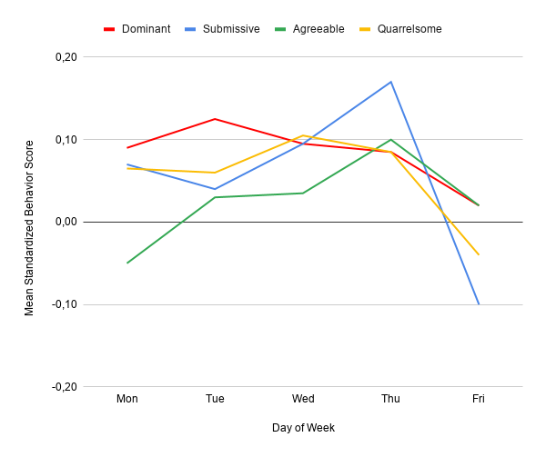
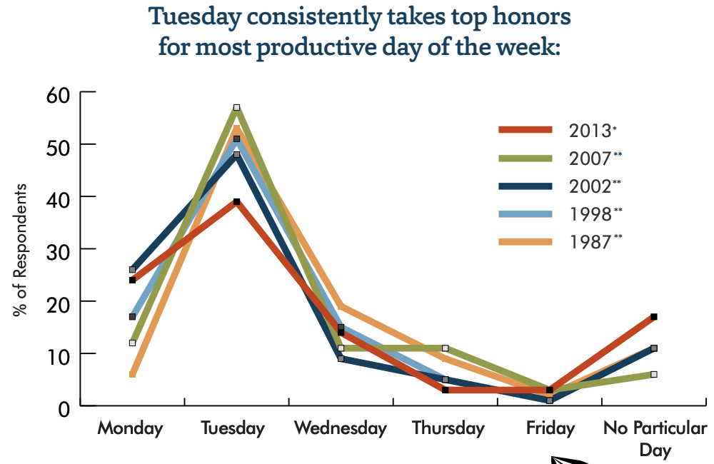

# Natural weekly rhythm

_Synchronize the rhythm of a week with productivity cycles for majority of people in the team to reduce stress and increase effectiveness._

|Purpose|Use time during a work week more effectively|
|-|-|
|Situation|Schedule is fragmented by meetings and lacks focus time|
||There is no time to rest between sprints|
|Outcomes|More focus time|
||Reduced stress levels|
|Effort|Low|
|Scope|Long-term|

## Infographics

## Situation

If you are creating team's meetings schedule from scratch or looking for opportunities to improve an existing one, this is your go to guide. It is based on studies on productivity and how people behave over the course of the week.

The problems that Natural Weekly Rhythm can help you solve include:

- Meetings every day interrupting the focus of the engineers
- No feeling that the work ever gets "finished", a never ending "flood" of work

This article doesn't consider how long your sprints/iterations should be. It is not specific to Scrum, Kanban or any other methodology. It just focuses on when it is better to schedule certain things.

## Recommendations

Use the above infographics together with your daily guide on which activities each day is best for.

### Monday

Monday is the best day for planning and scoping the upcoming work. The reason for that roots in how we see Monday as a beginning of a new week and we anticipate the things that we want to achieve that week. So it's quite natural to schedule planning activities on Monday. The energy levels are high on Monday, so plan your stuff and go crunching it!

Be careful with a few things though. First, Monday is the most frequent day when people are sick or take time off. It shouldn't stop the entire team from making plans, so be ready to have a Plan B.

Second, take it easy in the morning. Don't put your Sprint Planning meeting the first thing in the day. It takes some coffee and mental exercise for everyone to warm up their brains and get warmer to their colleagues.

### Tuesday

In all surveys Tuesday comes as an absolute productivity winner. After Monday's warm-up, the energy levels are at their peak and it's clear what needs to be done. The only thing that your team needs is to focus on the most important work.

The best way to use the most productive time may vary from team to team and person to person. Managers typically like to call ideation and brainstorming meetings, involving all the relevant people. While engineers prefer to focus on getting their tasks done, or pair on solving complex problems. Be mindful of interruptions, and don't let them ruin the momentum.

### Wednesday

On Wednesday the energy levels slowly start to decline, but people don't feel tired and can keep working on complex and creative stuff. It is very similar to Tuesday, so you can use it either for deep focus work, or for creative sessions involving a group of people.

### Thursday

Thursday is when the fatigue starts to creep in. And it's a good and a bad thing at the same time. It's bad because people can't focus so deeply and work so intensively anymore. And it's good because they become more agreeable to each other.

That's why Thursday is the best day for alignment meetings, one-on-ones, retrospectives, and similar activities.

### Friday

On Friday people are really looking forward to the weekend. They are tired after all the hard work and want to ease into the weekend. It results in loss of concentration. That's why last-minute changes going to production on Fridays are so frustrating: they often contain bugs, and fixing them urgently is the last thing you want to do on a Friday night.

Of course this doesn't mean that your team shouldn't write any code on Fridays. But you may want to do more coding on another day instead. These recommendations are about putting accents on certain activities throughout a week, not about banning everything else.

The best use of Fridays would be to review and celebrate progress. Things like demos or review meetings go nicely on Fridays. And it's always good to finish a week with a round of cheers and an informal chat.

### A note on time batching

Time batching is a popular technique for grouping similar activities together to reduce the amount and depth of context switching. It's a very useful technique when scheduling team activities. Batching meetings in the afternoon and leaving the morning free for focus work is one of the good examples.

Batching is proved to work well on a team level. One thing to be careful about is not to overbatch too many things in one day, don't forget that people may get exhausted after 4 meetings in a row. Focus, collaboration, and rest need some balance.

## Criticism

If you google the "best day to start a sprint", most of the articles in top results share the same thread:

> Don't start the sprints on Monday!

Here are the common reasons why this can be true for many teams:

- On Monday it takes more time and effort for the team to switch from weekend mood to a work mindset.
- At least 2 days in a sprint (Monday and Friday) are packed with team's ceremonies.
- On Friday people want to ease into the weekend. But if there is a lot of work left in the sprint, it becomes a hassle time. Trying to finish stuff between the meetings is a nightmare.
- Worst case scenario: the work that isn't finished on time during the week gets finished on the weekend.

What is usually suggested as a solution? Finish a previous sprint and start a new one in the middle of the week. Ideally on the same day on Wednesday: wrap up the last sprint in the morning, plan the next one in the afternoon.

Here are the advantages of this approach:

- The team is warmed up and has a lot of energy in the middle of the week, so the meetings go rather productively.
- Having all meetings concentrated in one day leaves a lot of space for focus work in the rest of the sprint.
- If some important work isn't finished on time, it can be completed the next day which is not weekend.

These are very good reasons. And for many teams finishing/starting sprints in the middle of the week is a solution to relevant problems. But I'm afraid that this approach is fixing the symptoms instead of curing the disease that caused them.

Let me try to put it together:

|Problem|Solution|Side effects|Real problem|Real solution|
|-|-|-|-|-|
|Warm-up time needed to start working|Review and plan work in the middle of the week|The most productive time spent in meetings|Any beginning starts with a warm-up|Accept it and focus on reducing the stress and increasing motivation to start the week easier|
|Finishing work in a rush on Friday|Borrow time from the next sprint in the middle of the week|The next sprint is affected|Unrealistic commitments in planning|Accept the carryover and focus on improving the planning process|
|Ceremonies interrupting the flow several days a week|Have all ceremonies on the same day|It becomes a "torture day" and the outcomes of these ceremonies degrade|Randomly assigned meeting times|Use the natural week rhythm recommendations above|

If your team suffers from these problems and you use middle-week sprint-to-sprint race as a solution, you're not alone. But instead of putting more pressure on the team, consider fixing the root causes. And then a more natural and relaxed week schedule won't look as such a bad idea.

## Why and how it actually works

Thanks a lot for reading so far! If you are fine with what was written above and are not up for long reads, feel free to stop here or skip to the next section.

If you are thinking "what if this guy just made this all up? Show me the data!" this section is for you!

It contains an overview of some of the research that Natural Weekly Rhythm guidelines are based on.

### Weekly cycle and psychological characteristics

There is a correlation between certain behavior and psychological affect with the cycle of a week.

In late 1990s a group of psychologists and researchers in McGill University of Canada performed a series of studies on various psychological factors in the social and work environment. One of the studies focused specifically on temporal effects on emotional and behavioral factors [4].

They found a certain pattern dependent on the weekly rhythm across multiple factors, which is presented on the following chart:

The vertical axis is a normalized value that represents how much respondents demonstrated certain behavior relative to their typical or average value for the same behavior. The horizontal axis shows how that behavior changes during the course of the week. I have omitted the weekend data, but you can find it in the original paper if you're interested.

The red line represents dominant behavior, while the blue one stands for submissive one. As you can see, in the beginning of the week people tend to be more dominant, while submissiveness grows by the end of the week. On Friday there is a drop in submissiveness, and all 4 factors decline on Friday as people are already easing out into the weekend mood.

The green line and orange one represent agreeable and quarrelsome behavior accordingly. Agreeability grows day by day and reaches its peak on Thursday. Quarrelsomeness maintains a similar level most of the time, but drops on Friday.

Here is what the authors of this research have shared about these patterns in multiple interviews like [this one](http://www.reporter-archive.mcgill.ca/Rep/r3015/moskowitz.html) and [this one](https://www.psychologytoday.com/intl/articles/199809/if-its-thursday-ask-raise):

- Energy levels are at maximum in the beginning of the week.
- Dominant behaviors are frequently correlated with getting things done — setting goals, organizing work, assigning responsibilities. Monday-Tuesday is the best time for activities of that kind.
- As the weekend gets closer, people become more agreeable and compromise. Thursdays and Fridays find us most open to negotiation and compromise because we want to finish our work before the week is out.

I actually observed these effects in my teams way before I came across the research by Moskowitz and Côté. These psychological effects play nicely with the structure of the Natural Weekly Rhythm:

- We plan things and set priorities in the beginning of the week when people have a lot of courage
- The scope is clear and there is still a lot of constructive energy - this is the focus time in the middle of the week
- At the end of the week it's time to retrospect, discuss non-urgent matters, and thank each other for the hard work

There is one more very interesting observation in that whitepaper. Apparently **introversion or extroversion matter a lot when it comes to temporal patterns**. The weekly pattern described above is more typical with introverts, while people with high level of extroversion demonstrate a similar pattern but their _cycle length is one day rather than one week_. In other words, extroverts tend to have a mini-weekend at the end of each day.

This means that whether Natural Weekly Rhythm is going to benefit your team or not and how much depends on the proportion of extroverts and introverts in the team. For extroverts any week schedule is more or less okay, as long as the meetings are structured wisely within the day. While introverts value the focus time in the middle of the week a lot.

Psychological factors are of course not equivalent to productivity. But there is plenty of research that connects psychological safety and comfort with long-term sustainability and throughput of the team. Westrum's research on Organizational Culture and Google's Project Aristotle are among the most well-known ones among the Tech community.

### Weekly cycle and productivity

#### LSE meta-research

A large meta-research on [Productivity and Days of the Week](http://eprints.lse.ac.uk/4963/1/daysoftheweek(LSEROversion).pdf) was published by the London School of Economics and Political Science in 2008 [2]. They have studied various research that already existed by the time and tried to answer multiple questions about time and productivity.

We have to omit the details of the original 30-page report and focus on some conclusions that can be drawn from it in the context of Software Engineering teams working 5 days from Monday to Friday.

_Percentage of employees working and average minutes worked by day of the week. Source: LSE calculations from UK Time Use Survey 2000_

The first conclusion is that none of the studies they considered was free of bias of a concrete company or group of people. So it's impossible to claim that productivity by the day of the week is always A or it's always B.

With that disclaimer, the most common thread that most of the studies share is that productivity levels are higher in the beginning of the week and slightly decrease by the end of the working week.

The recommendations that the authors carefully give to employers and regulators include:

- Concentrating more working hours in the middle of the week
- Moving bank holidays to Fridays instead of Mondays
- Giving teams freedom to decide on the work schedule based on their individual circumstances
- Protecting personal time outside of conventional working hours

The takeaways for us in the context of Natural Weekly Rhythm are:

- The most complex and important work happens in the middle of the week
- The end of the week activities should consider the decrease in productivity

#### Accountemps survey

In 2014 Accountemps, a Robert Half company, posted the [results of the survey](https://www.roberthalf.com/blog/management-tips/productivity-is-timing-everything) that they perform across ~300 Human Resources workers every decade [1]. The main question that they asked to their respondents is how productivity of their employees depend on day of the week and time.

Their conclusions are far more radical than the ones in the LSE research.

_Productivity by day of the week according to HR workers. Source: Accountemps, a Robert Half company_

300 respondents is not a large sample, and many people would argue the representativeness of such a survey. But interestingly, they've been performing the same survey every decade or so, and the results look very consistent over time.

The conclusions made by Accountemps:

- Tuesday is the most productive day
- Productivity levels decline by Friday
- Tuesday morning is the most productive time
- After 4 p.m. focus starts to dissipate
- Most employees feel more productive after vacation

### Days of the week and other social and psychological factors

[An article](https://www.theguardian.com/money/2007/jul/14/careers.work) posted in The Guardian [3] around the same time as the LSE whitepaper quotes several points from yet more research on days of the week.

Here is the week summary in important facts from multiple researchers:

- Monday is a champion of absences and sick leaves. There is a high level of stress associated with the start of a new working week after weekend
- Tuesday morning is a champion of productivity
- Wednesday is the best day for creative work and deep thinking
- Thursday is the best day for seeking agreement
- Friday is associated with a higher risk of accidents due to loss of concentration

According to this, it's better to unfold a new week slow and easy, avoiding too much stress on Monday caused by a cold start. In this regard, starting your week with a planning meeting may be too harsh.

The note about Fridays is yet another reminder that deploying new features in a rush on Friday is bad for everyone's nerves, including your customers.

## Practical outcomes

In the team where I first applied this weekly rhythm pattern we have undergone through multiple phases:

1. Starting sprints on Mondays and finishing on Fridays. We had the issue with remaining work accumulating at the end of the week. In a Retrospective we decided that the cure to this is to change the schedule.
1. Finishing sprints on Tuesday afternoon and starting on Wednesday morning. It fixed the problem of Fridays, but turned Wednesdays into rush hour. We were still trying to wrap up the previous sprint in the middle of planning the next one. After a series of retrospectives and iterations, we realised and fixed the problem with sprint commitments. But the team was still feeling exhausted by these mid-week gapless sprints.
1. Starting sprints on Mondays and finishing on Fridays again. By that time I came across some research on the subject of time and productivity, and decided to give it a try to reduce the stress levels and make the team feel better about accomplishing things.

I can't say that it changed drastically the amount of work that the team delivered. At least it was not visible in a short term. As we fixed our planning issues before that, the immediate impact on delivery was intangible.

What I observed for sure is that the overall stress levels in the team reduced and the team members were more satisfied with how they use their time and what they accomplish. Celebrating the complete (and in-progress!) work on Friday, thinking that you have the whole weekend to recharge your batteries before planning the new adventure - is priceless! Also the complaints about having meetings every day and no time to focus ceased to exist.

There was one issue that we haven't fixed in that team properly: too many meetings on Friday. But it can be done by moving some of them to e.g. Thursday.

## A note on Remote and Hybrid work

This is something that was only relevant for a few companies before the Covid-19 pandemic and became relevant for most of us after it.

How does the Weekly Rhythm work for remote teams?

For fully remote teams they work exactly the same as for fully onsite teams. Absolutely no issue here. It works naturally.

The challenges begin when you have part of the team remote and part of the team onsite. Especially if people choose their remote/onsite days somewhat randomly. Meetings work the best if either everyone is in the same room, or if everyone is joining remotely. Hybrid meetings unfortunately suffer from reduced inclusiveness and the digital/analog communication barrier.

When the company asked our team to consider switching from fully remote to a hybrid mode, we came up with the following hybrid solution:

- On Mondays very few people want to commute to the office, and we are fine with running the Planning remotely.
- On Tuesday or Wednesday we have some mandatory office time, to make sure we can have some important face time in a physical space. That mostly includes pair/mob programming on complex problems, or running brainstorming/ideation sessions.
- Thursday and Friday are free to come or stay home. There are certain benefits to both of them, and we don't want to force anything.

This is just an example, it may be completely different in your team. With the right setup and awareness the hybrid work is not so bad as many of us think.

## References

1. Accountemps. [Productivity: Is Timing Everything?](https://mba.americaeconomia.com/sites/mba.americaeconomia.com/files/at0216mscproductivityinfographic-slidesharenamengsec-160229185112_0.pdf)
1. Bryson, A., Forth, J. [Productivity and days of the week](http://eprints.lse.ac.uk/4963/1/daysoftheweek(LSEROversion).pdf). LSE Online - London School of Economics and Political Science.
1. Hollis, Liz. [Judgement days](https://www.theguardian.com/money/2007/jul/14/careers.work). The Guardian.
1. Moskowitz, D.S., Brown, K.W., Côté, S. [Reconceptualizing Stability: Using Time as a Psychological Dimension](https://journals.sagepub.com/doi/pdf/10.1111/1467-8721.ep10772890). Current Directions in Psychological Science (1997) Vol. 6 Issue 6, P.127-132