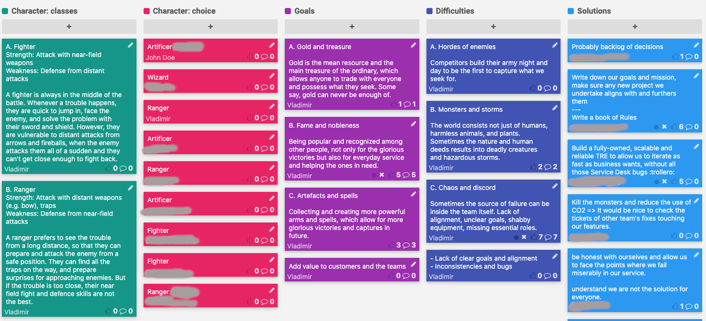

# Dungeons and Dragons Retrospective

|Type|Futurespective, game|
|----|-----------|
|Duration|90 minutes|
|Difficulty|Medium|

## Situation

There is a number of situations when you want to know your team better and help them learn each other better:

- Forming a new team
- Joining a new team as a manager
- New people joining an existing team

This technique is also useful as one of the FutureSpective formats: it can help the team see their goals clearer, understand their struggles, and come up with the solution.

This is where this gamified approach can come handy.

## Outcomes

- Knowing each other's personalities better
- Alignment on goals
- Systemic problems can be made clear

## Drawbacks

This retro format is not among the easiest ones:

- Takes a bit of courage to conduct, because you need to make it fun for it to work
- Is a long one, with all the explanations it will easily take more than an hour
- Playing the second time with the same team is not going to be as interesting

## Board example

## Gameplay

### 1. Character choice

The game starts with an explanation of characters _(3 min)_. Then each participant has _(5 min)_ to choose their own character and write it secretly on a card. When the time is up, the cards open up and each participant takes a minute to explain who they are and why. _(10-15 min for 10 participants)_.

#### Fighter

|Strength|Attack with near-field weapons|
|--------|------------------------------|
|Weakness|Defence from distant attacks|

A fighter is always in the middle of the battle. Whenever a trouble happens, they are quick to jump in, face the enemy, and solve the problem with their sword and shield. However, they are vulnerable to distant attacks from arrows and fireballs, when the enemy attacks them all of a sudden and they can't get close enough to fight back.

#### Ranger

|Strength|Attack with distant weapons (e.g. bow), traps|
|--------|------------------------------|
|Weakness|Defence from near-field attacks|

A ranger prefers to see the trouble from a long distance, so that they can prepare and attack the enemy from a safe position. They can find all the traps on the way, and prepare surprises for approaching enemies. But if the trouble is too close, their near field fight and defence skills are not the best.

#### Cleric

|Strength|Healing others, amplifying their attack and defence|
|--------|------------------------------|
|Weakness|Cannot use damaging spells|

A cleric heals their teammates and casts empowering spells on them. They make team stronger and heal wounds when somebody is in trouble, which makes them essential for the team. But if they are left alone with the enemy, they can only surrender.

#### Artificer

|Strength|Machines, mechanisms, and science|
|--------|------------------------------|
|Weakness|Cannot fight with typical weapons|

An artificer uses science and skills to build machines and mechanisms that help win battles and hold the forts. They can unlock doors and repair weapons for others. But they are not good at fighting themselves.

#### Wizard

|Strength|Magic|
|--------|------------------------------|
|Weakness|Cannot use weapons and armour|

A wizard uses the powers of fire, water, wind, and earth to put the enemy forces in trouble. They use their knowledge of matter and energy to do that. But without magical shield, brutal force is still dangerous for them.

### 2. Goal setting

Then the host reads out the goals and explains their meaning, answering questions if needed _(5 min)_. The team may also come up with other goals which are not present on the board initially. Then each participant votes for just 1 goal of their choice _(2 min)_. After that the team has to agree on common goals and their priority _(3 min)_.

#### Gold and treasure

Gold is the mean resource and the main treasure of the ordinary, which allows anyone to trade with everyone and possess what they seek. Some say, gold can never be enough of.

#### Fame and nobleness

Being popular and recognized among other people, not only for the glorious victories but also for everyday service and helping the ones in need.

#### Artifacts and spells

Collecting and creating more powerful arms and spells, which allow for more glorious victories and captures in future.

### 3. Difficulties

Having set the goal, it's time to think what stands between the team and their goal. The host reads out the options and adds suggestions from the group if they suggest reasonable additions _(5 min)_. Then the group votes for the top problem, one vote per participant _(2 min)_.

#### Hordes of enemies

Competitors build their army night and day to be the first to capture what we seek for.

#### Monsters and storms

The world consists not just of humans, harmless animals, and plants. Sometimes the nature and human deeds results into deadly creatures and hazardous storms.

#### Chaos and discord

Sometimes the source of failure can be inside the team itself. Lack of alignment, unclear goals, shabby equipment, missing essential roles.

### 4. Solutions

This is an open section when the team can suggest their own solutions. First they write it independently on cards _(5 min)_, and then pitch to the audience _(10 min)_ and group similar cards _(2 min)_. Eventually the team votes for one solution, up to two votes per person _(2 min)_.

### Reading the story

Then the host or volunteers from the group read the whole story: a team of Characters gathered to achieve their Goal, but they met Difficulties on the way and used the Solution(s) to get what they came for.

## References

I came up with this game over a weekend, no references used.
